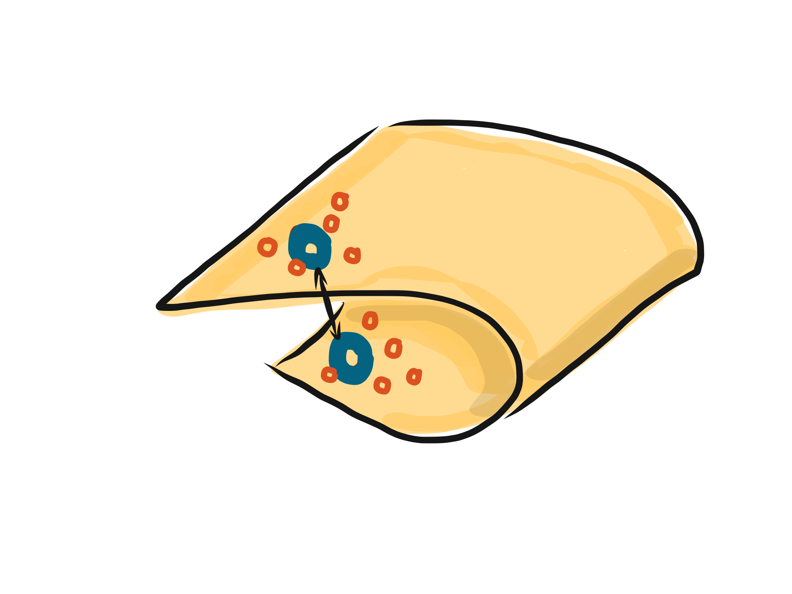
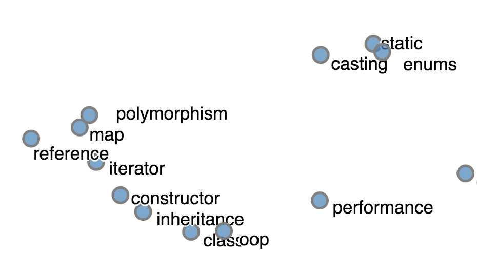

- title : Exploring StackOverflow 
- description : Exploring StackOverflow with F# and R.
- author : Evelina Gabasova
- theme : white
- transition : none

***

- data-background: images/posts-background.png
- class : withbackground

# 
 Exploring StackOverflow 

## 
 Evelina Gabasova 

## 
 @evelgab 

------------------------------------------------------------------------------------------------

 

------------------------------------------------------------------------------------------------

- data-background: #d3d3d3

------------------------------------------------------------------------------------------------

- data-background: #d3d3d3

------------------------------------------------------------------------------------------------

- data-background: #d3d3d3

------------------------------------------------------------------------------------------------

- data-background : black

' 135 GB approx

************************************************************************************************

- data-background: images/posts-background.png
- class : withbackground

<h1 style="font-size:200pt"> ? </h1>

------------------------------------------------------------------------------------------------

------------------------------------------------------------------------------------------------

------------------------------------------------------------------------------------------------

# Question: Where?

' Are there local pockets for some of the languages?
' Where is each technology used?
' technology: type providers for JSON & Bing, HTML & Wikipedia, charting
' insights: technology countries, where are programmers concentrated

------------------------------------------------------------------------------------------------

# Where?

- 5 277 833 users in total

- 769 541 filled in their location

------------------------------------------------------------------------------------------------

- data-background : black

### $HOME

------------------------------------------------------------------------------------------------

- data-background : black

# 83%

------------------------------------------------------------------------------------------------

- data-background : black

### (Unfortunately) Germany

------------------------------------------------------------------------------------------------

- data-background : black

### 7151 Mawson Station, Australian Antarctic Territory, Antarctica

------------------------------------------------------------------------------------------------

- data-background : images/antarctica.jpg

------------------------------------------------------------------------------------------------

- data-background: images/posts-background.png
- class : withbackground 

# Where?

' demo: JSON type provider + Bing map API

------------------------------------------------------------------------------------------------

### Javascript

------------------------------------------------------------------------------------------------

$$$
n \times \frac{1}{\text{population}} \times \frac{\text{registered}}{\text{located}}  \times 1,000,000

 
 

 
### ppm (Programmers-per-million) 

------------------------------------------------------------------------------------------------

- data-background: images/posts-background.png
- class : withbackground 

# Where really?

' we need population
' demo: HTML type provider

------------------------------------------------------------------------------------------------

#### F#

------------------------------------------------------------------------------------------------

------------------------------------------------------------------------------------------------

- data-background : images/dominican-republic.jpg

------------------------------------------------------------------------------------------------

- data-background : #121412

## (Sampling bias)

' only registered users
' only active users
' and out of them, only the ones that gave out their address

************************************************************************************************

------------------------------------------------------------------------------------------------

# Tags + Users

# = 
# Communities

' Users ask questions with specific tags & answer questions with specific tags
' No-one knows everything

' how to define relation between tags through posts & users, similar users - similar tags
' memory vs. distributed computing
' t-SNE visualization - how to create a meaningful visualization
' Networks
' technology: RProvider, Fable

------------------------------------------------------------------------------------------------

# Tags 

### define 

# relations

------------------------------------------------------------------------------------------------

|           | F# | C# | JS | R | Cobol |
|-----------|----|----|------------|---|---|
| Evelina   | 1  | 0  | 1          | 1 | 0 |
| Tomas | 1  | 1  | 1          | 0 | 0 |

------------------------------------------------------------------------------------------------

### 44 265 tags x  5 277 831 users

------------------------------------------------------------------------------------------------

#### Users with more than 1,000 posts
#### Tags with more than 5,000 posts

## 807 tags, 1633 power users

------------------------------------------------------------------------------------------------

# t-SNE
## t-distributed Stochastic Neighbourhood embedding

------------------------------------------------------------------------------------------------

# Embedding

------------------------------------------------------------------------------------------------

------------------------------------------------------------------------------------------------

------------------------------------------------------------------------------------------------

------------------------------------------------------------------------------------------------

------------------------------------------------------------------------------------------------

------------------------------------------------------------------------------------------------

------------------------------------------------------------------------------------------------
# t-SNE in R

    [lang=R]
    library(tsne)

    ts <- tsne(m, perplexity=20)

    plot(ts)

------------------------------------------------------------------------------------------------

# t-SNE in F#

    open RProvider
    open RProvider.tsne

    let ts = R.tsne(namedParams[ "X", box m; "perplexity", box 20])

    R.plot(ts)

------------------------------------------------------------------------------------------------

- data-background : images/rplot.png

------------------------------------------------------------------------------------------------

*The best thing about R is that it was written by statisticians.*

*The worst thing about R is that it was written by statisticians.*

 

Bow Cowgill, 2009

------------------------------------------------------------------------------------------------

## fable.io

------------------------------------------------------------------------------------------------

- data-background : images/tsne-full.png

------------------------------------------------------------------------------------------------

------------------------------------------------------------------------------------------------

------------------------------------------------------------------------------------------------

------------------------------------------------------------------------------------------------

Platzer, A. (2013). Visualization of SNPs with t-SNE. PLoS ONE, 8(2), e56883. 

************************************************************************************************

- data-background : images/beach.jpg

<table>
<tr>
  <td class="noborder" style="width:60%;"></td>
   <td class="noborder" style="width:40%;">

<h2> 
 Evelina Gabasova 
 </h2>

@evelgab  
evelinag.com 

      
</td> 
</tr>
</table>

